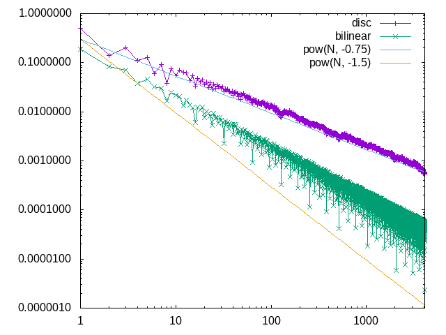
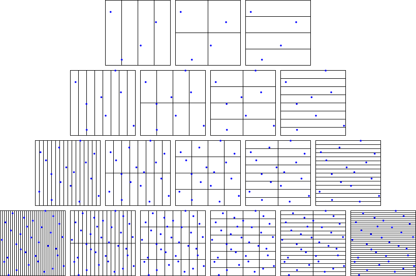
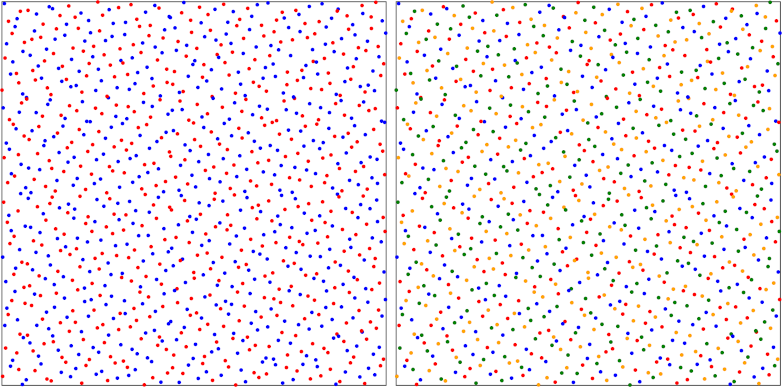

# Progressive Multi-Jittered Sample Sequences

Rust code to generate the pmj02 and pmj02b point sets as described in the following papers:

* [Progressive Multi-Jittered Sample Sequences](https://graphics.pixar.com/library/ProgressiveMultiJitteredSampling/) by Christensen et al.
* [Efficient Generation of Points that Satisfy Two-Dimensional Elementary Intervals](http://jcgt.org/published/0008/01/04/) by Matt Pharr.

## Usage

```rust
use pmj::{generate, Sample};
use rand::prelude::*;

fn main() {
    // generate 4096 samples uing SmallRnd from the rand crate
    let mut rng = SmallRng::seed_from_u64(SEED);
    let samples = generate(4096, 0, &mut || rng.gen::<u32>());

    // print coordinates
    for s in &samples {
        println!("sample: {}, {}", s.x(), s.y());
    }
}
```

Performance seems to be comparable to the figures stated in the second paper.  Generating 4096 points as above takes around 4.8ms on a 1.7GHz CPU (compared to 3.19ms on a 4GHz CPU stated in the paper).

## Examples

The `measure` example measures the integration convergence rate (averaged over 100 sequences) for the "disc" and "bilinear" functions in the first paper:



The `plot` example produces svg images to inspect the stratification and classes of the generated samples.  Here is the output showing the stratification of a single sequence when looking at the first 4/8/16/32 samples:



Here is the output showing the first 1024 samples split into 2 or 4 classes:


